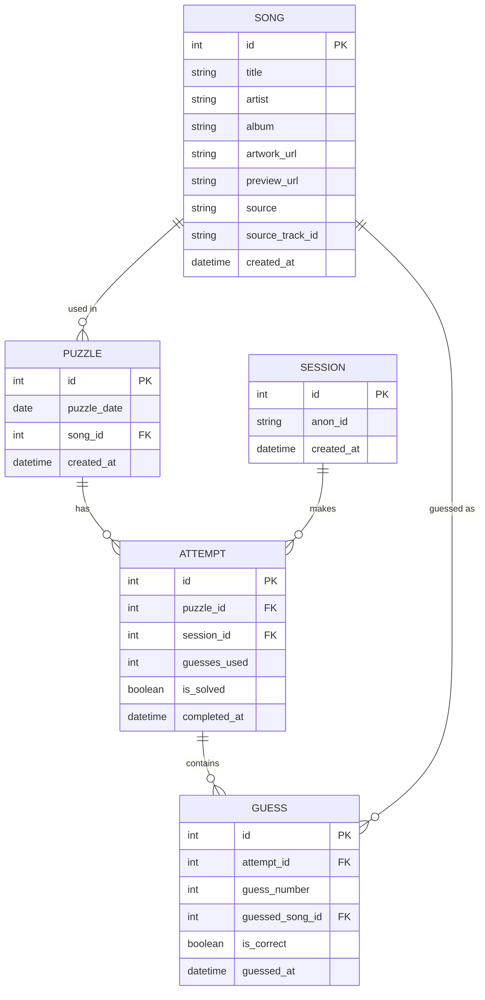

# Build Prompt: "Song Guesser" — A Heardle-Style Music Guessing Game

Use this document as a single build prompt for a coding assistant (or as your own dev spec). It covers architecture, data sourcing, config, UI, and the full ERD.

---

## 1. Concept

A daily music-guessing game. Each day there is one target song. The player hears an increasingly long snippet of the intro with each guess (up to 6 guesses). They type into a search box that autocompletes against the game's own song database (not a live external search) and picks a match. Correct guess or 6th wrong guess ends the round and reveals the answer.

---

## 2. Tech Stack

| Layer | Choice | Notes |
|---|---|---|
| Frontend | React (Vite) | fast dev server, easy static deploy |
| Backend | Node.js + Express | thin REST API |
| Database | SQLite (via `better-sqlite3`) | zero-config, file-based, still fully relational |
| Audio source | Deezer API | free, no auth, no hosting of audio files required |
| Hosting | Frontend: Vercel/Netlify. Backend+DB: Render/Fly.io (SQLite file persisted on a small volume) | free-tier friendly |

You are **not** downloading or storing any audio files. You store metadata (title, artist, artwork URL, preview URL, source track ID) and stream the preview clip directly from Apple's/Deezer's CDN in the browser `<audio>` element. This avoids licensing/storage problems entirely.

---

## 3. Where songs come from (source of truth)

Two-tier approach so it's low-effort to start and easy to keep adding to. Everything comes from the **Deezer API** — free, no key/signup, one call returns title, artist, album art, and a 30-second preview:

`GET https://api.deezer.com/search?q=<title> <artist>`

```json
{
  "data": [
    {
      "id": 3135556,
      "title": "Blinding Lights",
      "artist": { "name": "The Weeknd" },
      "album": {
        "cover_medium": "https://e-cdns-images.dzcdn.net/images/cover/.../250x250.jpg",
        "cover_big": "https://e-cdns-images.dzcdn.net/images/cover/.../500x500.jpg"
      },
      "preview": "https://cdns-preview-....dzcdn.net/stream/....mp3",
      "duration": 200
    }
  ]
}
```

1. **Seed script** pulls from a curated JSON list of well-known song titles (you write/maintain this list — e.g. `seedList.json` with `{title, artist}` pairs) → for each entry, calls the Deezer search endpoint above and takes the first result. Stores `title`, `artist.name`, `album.cover_big` (artwork), `preview` (audio URL), and `id` (Deezer track id) in the `songs` table.
2. **Manual add script/endpoint** (`POST /admin/songs`) — you paste a song title + artist, it does the same Deezer lookup and inserts one row. This is your easy path to keep the pool growing without touching code.

Rate limit note: Deezer's public API allows roughly 50 requests per 5 seconds per IP — much more forgiving than iTunes was, but still add a small delay (e.g. 200ms) between seed requests to stay well under it.

---

## 4. Snippet duration — fully configurable, not hardcoded

Store timings in a plain JSON config file (`config/snippetDurations.json`) read by the backend at request time (no restart needed if you use a file-watcher, or just re-read on each request since it's tiny):

```json
{
  "guessDurationsMs": [1000, 2000, 4000, 7000, 11000, 16000],
  "maxGuesses": 6
}
```

- Backend serves this to the frontend via `GET /api/config`.
- Frontend uses `guessDurationsMs[currentGuessIndex]` to know how much of the preview clip to allow playback of on each attempt (implemented by stopping playback via `setTimeout` at that many ms, always starting from 0:00).
- To retune difficulty, you just edit the JSON — array length should always match `maxGuesses`.

---

## 5. Frontend UI (minimal / sleek / clean — dark theme, like your reference screenshot)

- Dark background (`#111` or near-black), thin 1px borders, generous whitespace, a single accent color (e.g. muted blue) for primary actions only.
- Top bar: game title, stats icon, info/help icon.
- 6 horizontal guess-history boxes (empty until filled) showing prior guesses (song title + artist), color-coded correct/incorrect.
- Center: a minimal waveform/play button, elapsed-time progress bar with tick marks at each duration threshold, current-snippet-length label (e.g. "0:04").
- Search input with live autocomplete:
  - Debounced `GET /api/search?q=...` hits your **own** song table (SQL `LIKE` or a lightweight fuzzy match library like `fuzzysort`) — not a live external API, since the guess has to match something in your answer pool.
  - Dropdown shows album art thumbnail + song title + artist name per result, like a Google-style suggestion list.
  - Clicking a suggestion fills the input and enables Submit; Skip button advances to the next snippet length without a guess.
- On win/loss: reveal full artwork, title, artist, a "share your result" grid (emoji-square style like Wordle), and a link to play the song externally.

---

## 6. API Endpoints

| Method | Route | Purpose |
|---|---|---|
| GET | `/api/config` | returns snippet duration config |
| GET | `/api/puzzle/today` | returns today's puzzle id + preview_url + total guesses (never the song title/artist) |
| GET | `/api/search?q=` | autocomplete against the local `songs` table |
| POST | `/api/guess` | body: `{puzzleId, sessionId, songId}` → returns correct/incorrect + reveals answer if game over |
| POST | `/admin/songs` | add a song by title+artist (does Deezer lookup + insert) |
| POST | `/admin/puzzle` | schedule a song for a given date |

---

## 7. Entity-Relationship Diagram



**Notes on the schema:**
- `source` / `source_track_id` on `SONG` will just always be `"deezer"` + the Deezer track id for now — kept as separate columns (rather than assumed) so you can plug in another provider later without a schema change.
- `SESSION` is an anonymous device/browser id (localStorage-generated UUID) — no login required for v1, but leaves room to add real accounts later.
- `GUESS` is its own table (not a JSON blob on `ATTEMPT`) so you can compute stats like "average guess number to solve" per song later.
- `snippetDurations` deliberately lives in a config file, not a DB table, per your requirement — it's a global game rule, not per-puzzle data. (If you ever want per-puzzle custom difficulty, add a `guess_durations_json` column to `PUZZLE` later — the schema supports that extension without breaking anything.)

---

## 8. Suggested folder structure

```
/server
  /db          → schema.sql, seed.js, db.js (better-sqlite3 setup)
  /routes      → config.js, puzzle.js, search.js, guess.js, admin.js
  /services    → deezerClient.js
  /config      → snippetDurations.json
  index.js
/client
  /src
    /components → GuessGrid, Player, SearchAutocomplete, ResultShare
    /hooks      → useGameState, useAudioSnippet
    App.jsx
```

---

## 9. Build order (phases)

1. SQLite schema + seed script pulling ~50 popular songs via the Deezer API.
2. Backend endpoints: `/api/config`, `/api/puzzle/today`, `/api/search`, `/api/guess`.
3. Frontend: static UI shell matching the minimal dark design, wired to `/api/config` and `/api/puzzle/today`.
4. Audio snippet playback logic (stop at configured ms per guess).
5. Autocomplete search + guess submission + guess-history boxes.
6. Win/loss screen + share grid.
7. Admin add-song script/endpoint for easy pool growth.
8. Polish: animations, mobile responsiveness, daily puzzle rotation (cron or date-based lookup).

---

## 10. Local Setup & Testing (dev environment)

### 10.1 Prerequisites
- Node.js 18+ and npm installed
- No local database server needed — SQLite is just a file

### 10.2 Project init

```bash
mkdir song-guesser && cd song-guesser
mkdir server client

# --- server ---
cd server
npm init -y
npm install express better-sqlite3 cors dotenv node-fetch fuzzysort
npm install -D nodemon
cd ..

# --- client ---
npm create vite@latest client -- --template react
cd client
npm install
cd ..
```

### 10.3 Environment variables

`server/.env`:
```
PORT=4000
DB_PATH=./data/songs.db
CLIENT_ORIGIN=http://localhost:5173
```

`client/.env`:
```
VITE_API_BASE_URL=http://localhost:4000
```

Both `.env` files should be gitignored. Commit `.env.example` versions instead so anyone cloning the repo knows what to fill in.

### 10.4 package.json scripts

`server/package.json`:
```json
{
  "scripts": {
    "dev": "nodemon index.js",
    "start": "node index.js",
    "seed": "node db/seed.js",
    "migrate": "node db/migrate.js"
  }
}
```

`client/package.json` (Vite default, already includes these):
```json
{
  "scripts": {
    "dev": "vite",
    "build": "vite build",
    "preview": "vite preview"
  }
}
```

Optional: add a root-level `package.json` with a `concurrently`-based script so `npm run dev` at the project root starts both:
```json
{
  "scripts": {
    "dev": "concurrently \"npm run dev --prefix server\" \"npm run dev --prefix client\""
  },
  "devDependencies": { "concurrently": "^8.0.0" }
}
```

### 10.5 First-run checklist

```bash
# 1. create DB schema
cd server && npm run migrate

# 2. seed ~50 songs from the Deezer API (takes under a minute)
npm run seed

# 3. schedule today's puzzle (or write a tiny script that auto-picks
#    an unused song for any date with no puzzle row yet)
node db/scheduleToday.js

# 4. start backend
npm run dev          # http://localhost:4000

# 5. in a second terminal, start frontend
cd ../client && npm run dev   # http://localhost:5173
```

Open `http://localhost:5173` — the app should load today's puzzle, play a 1-second snippet on first guess, and let you search/guess against the seeded songs.

### 10.6 Manual test pass (no automated tests required for v1, but check these by hand)

- [ ] `/api/config` returns your JSON durations unmodified
- [ ] `/api/puzzle/today` never leaks the song title/artist in the response
- [ ] Snippet playback actually stops at the configured ms (test with browser devtools Network throttling off)
- [ ] Autocomplete returns results within ~150ms and shows artwork + artist
- [ ] A correct guess ends the game and reveals the song immediately, even before 6 guesses
- [ ] A 6th wrong guess ends the game and reveals the song
- [ ] Reloading the page mid-game keeps your session state (store `attemptId` + guesses in localStorage keyed by today's date)
- [ ] Adding a song via `POST /admin/songs` with just a title+artist correctly resolves artwork/preview via Deezer

### 10.7 Deploying

**Backend (Render, simplest for a persistent SQLite file):**
1. Push repo to GitHub.
2. New Render Web Service → connect repo, root directory `server`.
3. Build command: `npm install`. Start command: `npm start`.
4. Add a **Render Disk** (1GB is plenty) mounted at e.g. `/data`, set `DB_PATH=/data/songs.db` in Render's environment variables so the SQLite file survives deploys/restarts.
5. Set `CLIENT_ORIGIN` to your deployed frontend URL once you have it (for CORS).
6. After first deploy, run migrate + seed once via Render's shell tab.

**Frontend (Vercel or Netlify):**
1. New project → connect repo, root directory `client`.
2. Build command: `npm run build`. Output directory: `dist`.
3. Set `VITE_API_BASE_URL` to your Render backend URL.

**Daily puzzle rotation:** simplest option is a tiny cron job (Render Cron Job, or a `node-cron` task inside the Express app) that runs once a day and, if no `PUZZLE` row exists for today's date, auto-schedules the next unused song from the pool. This means you never have to manually update anything as long as the song pool has enough unused entries ahead of it.

### 10.8 Common local gotchas
- **CORS errors in dev:** make sure `CLIENT_ORIGIN` in the server `.env` matches the Vite dev server URL exactly (including port).
- **`better-sqlite3` native build fails:** run `npm rebuild better-sqlite3` after switching Node versions.
- **Deezer empty results while seeding:** double check your query string is URL-encoded (`encodeURIComponent`) and try title-only if title+artist returns nothing — some tracks match better with just the title.
- **Deezer preview is null for a track:** rare, but happens for a small number of tracks (usually regional licensing). Just pick a different song for your curated list.
- **Preview URL plays full song instead of stopping:** double check you're calling `audio.pause()` via `setTimeout` keyed to `guessDurationsMs[currentGuessIndex]`, and always resetting `audio.currentTime = 0` before each play so every guess replays from the start of the clip.
